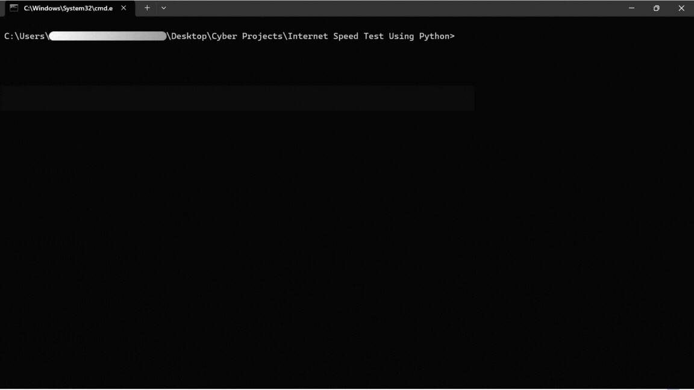

# Internet Speed Test Using Python

This Python program measures the upload and download speed (in Megabytes) of the connected internet.

## Demo



## Description

The program utilizes Python to measure internet speed. It provides insights into both upload and download speeds, helping users understand their internet connection's performance.

## Requirements

Ensure you have the following libraries installed:

- `speedtest-cli`: Used for conducting internet speed tests. You can install it via pip: `pip install speedtest-cli`

## Usage

1. Clone the repository or download the Python script.
2. Install the required library using `pip install speedtest-cli`.
3. Run the Python script.

```python
python main.py
